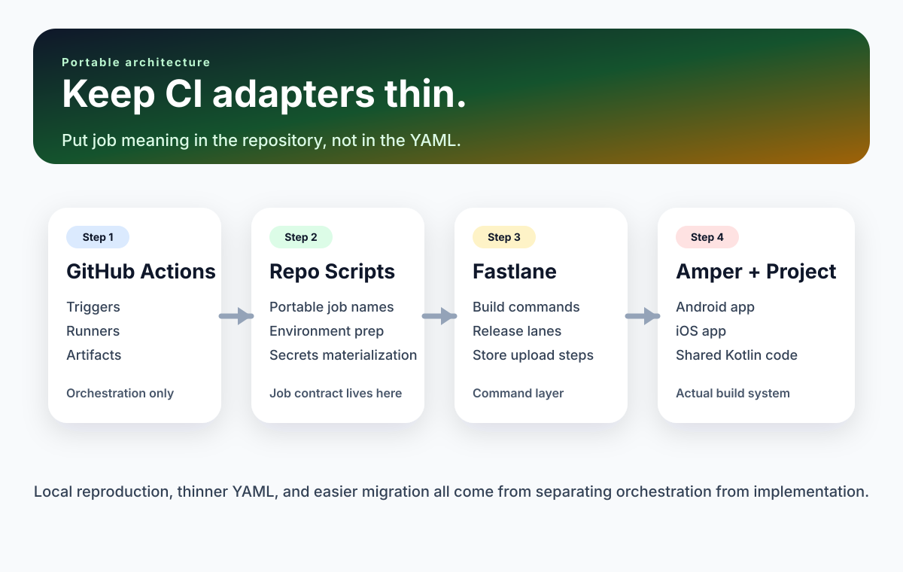
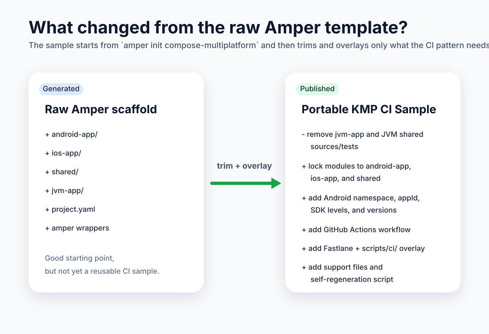

# Stop Putting Your Kotlin Multiplatform CI Logic in YAML

This project did not start as an attempt to invent a "portable CI
architecture" for Kotlin Multiplatform.

It started as a practical effort to get a mobile pipeline under control.

The usual pattern showed up quickly: more logic in GitHub Actions, more
conditionals, more environment-specific behavior, more secrets handling, more
release steps, and more moments where the answer to "what does this job
actually do?" was "open the CI UI and start digging."

That works for a while, until it does not.

At some point, the YAML stops being orchestration and starts becoming the
application. Local reproduction gets harder. Migrating between CI providers
gets expensive. Debugging turns into archaeology.

The approach in this sample takes a different route: move the job contract into
the repository, and let the CI adapter stay thin.

That decision produced a Kotlin Multiplatform mobile CI setup that is easier to
run locally, easier to explain, and easier to share with other teams.



## The real problem with mobile CI

Kotlin Multiplatform mobile CI is not hard because any single step is unusual.
It is hard because too many concerns pile up in the same place:

- Android builds
- Android tests
- iOS builds
- archive and upload flows
- versioning
- signing
- store credentials
- runner-specific setup
- CI-provider-specific environment variables

When all of that gets pushed directly into YAML, the pipeline becomes tightly
coupled to the CI product that happens to be running it.

That creates a few predictable problems:

- the workflow becomes harder to read than the codebase it builds
- local debugging stops looking like CI debugging
- secrets handling gets duplicated in too many places
- switching CI providers starts to feel like a rewrite

The issue is not YAML itself. The issue is putting too much meaning into it.

One practical note from running this sample on real runners: the current Amper
Android integration expects Java 21. That is why the workflows in this repo now
pin Temurin 21 instead of Java 17.

## The shift that made this manageable

This setup is built around one idea:

CI should describe when a job runs, not what the job means.

Once that principle is applied, the architecture gets much simpler:

1. GitHub Actions decides when to run a job.
2. A shared repository script decides what that job means.
3. Helper scripts prepare the environment the same way everywhere.
4. Fastlane provides the build and release command layer.
5. Amper remains the actual build system.

In this sample repository, the layers look like this:

- [`.github/workflows/mobile-ci.yml`](https://github.com/Mekate-Studio/Portable-KMP-CI/blob/main/.github/workflows/mobile-ci.yml)
- [`scripts/ci/run_job.sh`](https://github.com/Mekate-Studio/Portable-KMP-CI/blob/main/scripts/ci/run_job.sh)
- [`scripts/ci/lib/`](https://github.com/Mekate-Studio/Portable-KMP-CI/tree/main/scripts/ci/lib)
- [`fastlane/Fastfile`](https://github.com/Mekate-Studio/Portable-KMP-CI/blob/main/fastlane/Fastfile)
- [`project.yaml`](https://github.com/Mekate-Studio/Portable-KMP-CI/blob/main/project.yaml)

The pipeline now has a stable contract that lives inside the repo.

That contract is a set of portable job names:

- `android-build-debug`
- `android-build-release`
- `android-test`
- `ios-build-debug`
- `ios-build-release`
- `ios-archive-release`
- `ios-testflight`
- `publish-internal`
- `promote-alpha`
- `promote-beta`
- `promote-production`

Those names are more valuable than they look. They give a team a shared
vocabulary. They let local development and CI talk about the same operations.
They make it obvious what belongs in the repo and what belongs in the CI
adapter.

## Start with Amper, not with a handcrafted demo app

One of the strongest parts of this workflow is that it starts from a generated
project instead of a hand-assembled example.

The Amper CLI can scaffold a strong starting point:

```bash
mkdir my-kmp-ci-app
cd my-kmp-ci-app
amper init compose-multiplatform
```

That matters because it gives readers a command they can run, not just a repo
they are supposed to copy blindly.

The generated project already includes:

- `android-app/`
- `ios-app/`
- `shared/`
- `project.yaml`
- checked-in `amper` wrappers

It also includes a `jvm-app/` module. This sample removes that module to keep
the public story focused on Android, iOS, and shared code.

This repository is that trimmed public sample.


## What changed from the raw Amper template?

The sample starts from `amper init compose-multiplatform`, but it does not stop
there.



The main edits that turn the generated app into a reusable CI sample are:

- remove `jvm-app/` and the JVM-specific shared sources and tests
- lock `project.yaml` to `android-app`, `ios-app`, and `shared`
- add Android-specific settings such as namespace, application ID, SDK levels,
  and version fields
- add the GitHub Actions workflow, Fastlane files, and shared `scripts/ci/`
  layer
- add a few practical support files such as the Android keystore example,
  shared Android manifest, and ProGuard placeholder
- add `./scripts/regenerate_from_amper.sh` so the sample can be rebuilt from a
  fresh Amper template when the scaffolding changes

That combination keeps the sample honest: it stays close to the generated Amper
baseline while still exercising the CI architecture that the article is trying
to teach.

## The sample can regenerate itself

This repo also includes a maintenance command:

```bash
./scripts/regenerate_from_amper.sh
```

That script reruns `amper init compose-multiplatform`, trims the generated
project back to Android + iOS + shared, and then reapplies the project-specific
adjustments that this CI setup expects.

It deletes and recreates the generated app layer:

- `amper`
- `amper.bat`
- `project.yaml`
- `android-app/`
- `ios-app/`
- `shared/`

while preserving the CI files and release helpers that belong to this sample.

That gives the project a much better maintenance story. When Amper changes, the
sample can be refreshed from a command instead of being rewritten by hand.

## What "thin CI" actually looks like

Once the real job logic moves into the repo, the GitHub Actions workflow gets
surprisingly boring.

That is a good thing.

A typical job becomes little more than:

```yaml
- uses: actions/checkout@v4
    - uses: actions/setup-java@v4
      with:
        distribution: temurin
        java-version: "21"
- uses: ruby/setup-ruby@v1
  with:
    bundler-cache: true
- uses: android-actions/setup-android@v3
- name: Build Android debug
  run: ./scripts/ci/run_job.sh android-build-debug
```

At that point, the YAML is doing exactly what it should do:

- pick a runner
- install prerequisites
- define dependencies
- scope environments
- move artifacts around

And it is not doing a bunch of things it should not do:

- encode build logic
- normalize CI variables
- rewrite secrets into local files
- invent a second command system

That is the difference between orchestration and implementation.

## The dispatcher is where the pipeline becomes understandable

The shared entrypoint is [`scripts/ci/run_job.sh`](https://github.com/Mekate-Studio/Portable-KMP-CI/blob/main/scripts/ci/run_job.sh).

It answers the question every pipeline eventually needs to answer clearly:

"What does this job actually do?"

Here is the shape of it:

```bash
case "${job_name}" in
  android-build-debug)
    ci_prepare_android_job
    ./scripts/ci/run_fastlane_with_amper_logs.sh buildDebug
    ;;
  ios-testflight)
    ci_prepare_ios_testflight_job
    bundle exec fastlane ios uploadTestFlight
    ;;
esac
```

That is dramatically easier to reason about than chasing behavior across a CI
file full of conditionals, environment mappings, and inline shell.

It also means a developer can run the exact same job locally without faking an
entire CI environment.

## The helper scripts do the quiet work that usually clutters pipelines

Most of the portability comes from the helper layer under
[`scripts/ci/lib/`](https://github.com/Mekate-Studio/Portable-KMP-CI/tree/main/scripts/ci/lib).

That layer is responsible for:

- preparing a writable Amper cache
- setting up Java and PATH consistently
- detecting the Android SDK
- running Bundler the same way everywhere
- materializing signing files and API keys only when needed

That gives the rest of the pipeline stable concepts such as:

- `BUILD_NUMBER`
- `BUILD_SHA`
- `BUILD_BRANCH`
- `DEFAULT_BRANCH`
- `VERSION_CODE`
- `VERSION_NAME`
- `IOS_BUILD_NUMBER`

Once those values are normalized, the actual job logic stops caring whether it
is running in GitHub Actions or a local shell session.

## Separating validation from release makes the pipeline calmer

One of the best decisions in this setup is to keep normal CI validation
separate from release delivery.

For Android, that means separate jobs for:

- debug builds
- release builds
- tests
- Play internal publishing
- promotion across tracks

For iOS, it means separating:

- unsigned CI sanity builds
- signed archive generation
- TestFlight upload

That split is not just organizational neatness. It keeps normal pull request
feedback from depending on Apple signing or release credentials. It makes store
delivery something deliberate instead of something every commit has to survive.

## Secrets are materialized at runtime, not stored in the repo

This repository does not commit signing files or API keys.

Instead, release-oriented jobs materialize them at runtime through small helper
scripts:

- [`scripts/ci/write_android_signing_files.sh`](https://github.com/Mekate-Studio/Portable-KMP-CI/blob/main/scripts/ci/write_android_signing_files.sh)
- [`scripts/ci/write_google_play_key.sh`](https://github.com/Mekate-Studio/Portable-KMP-CI/blob/main/scripts/ci/write_google_play_key.sh)
- [`scripts/ci/write_app_store_connect_api_key.sh`](https://github.com/Mekate-Studio/Portable-KMP-CI/blob/main/scripts/ci/write_app_store_connect_api_key.sh)

There is still one unavoidable caveat on the iOS side: Apple certificates and
provisioning profiles have to exist on the macOS runner that performs the
archive. A repository can materialize API keys, but it cannot replace proper
host-level signing setup.

That is not a flaw in the design. It is just the reality of Apple delivery
workflows.

## Fastlane still makes sense here

Fastlane fits well into this arrangement because it sits at a natural boundary.

It is not trying to be the CI orchestrator. It is not trying to replace the
build system. It is simply the command layer between the repository scripts and
the platform-specific delivery steps.

That keeps the responsibilities clean:

- Amper builds the project
- Fastlane wraps build and delivery commands
- shell scripts prepare the environment
- GitHub Actions orchestrates execution

## Local reproduction stopped being an afterthought

Because the job contract lives in the repository, the same jobs can run locally
that CI runs:

```bash
export AMPER_BOOTSTRAP_CACHE_DIR="$PWD/.amper-cache"
./scripts/ci/run_job.sh android-build-debug
./scripts/ci/run_job.sh android-test
./scripts/ci/run_job.sh ios-build-debug
```

For current Amper-based Android builds, local reproduction also assumes JDK 21.
On self-hosted macOS runners, this sample also expects a host-installed Ruby,
preferably from Homebrew, and lets the shared CI helper install the Bundler
version required by `Gemfile.lock`.

The iOS build jobs in this sample use a generic iOS Simulator destination for
`xcodebuild`, but they also force a single simulator architecture that matches
the host machine. That avoids depending on a precreated simulator device while
also avoiding Amper's current limitation around multi-architecture simulator
builds. The remaining requirement is that the runner still has an iOS
Simulator runtime installed in Xcode.

That distinction matters on GitHub-hosted macOS images. A repository can avoid
depending on a specific device, but it cannot force the hosted image to ship a
Simulator runtime that is not installed. When that happens, the remaining fix
is to select an image or Xcode version that includes a runtime, or to install
one explicitly as part of runner provisioning.

That changes debugging completely.

If a shared job works locally, then most remaining failures are usually much
narrower:

- missing secrets
- runner provisioning gaps
- artifact handoff issues
- environment scoping mistakes

That is a much better place to debug from.

## Roll it out slowly

Even with a cleaner architecture, release workflows are still release
workflows. A sensible rollout looks like this:

1. Get Android debug build working locally.
2. Get Android tests working locally.
3. Get iOS debug build working locally.
4. Move those jobs into CI.
5. Add Android release signing.
6. Publish manually to Play internal testing.
7. Add iOS archive signing on the macOS runner.
8. Upload manually to TestFlight.
9. Add promotion flows only after the basics are stable.

That order keeps the learning curve manageable and avoids conflating pipeline
design problems with store-delivery complexity.

## The part worth copying

The most useful thing here is not a specific Actions feature, a specific
Fastlane lane, or a specific Amper command.

It is the decision to stop treating the CI provider as the home of the build
logic.

Once the job contract moved into the repository, a lot of problems got smaller:

- the pipeline became easier to explain
- local reproduction became normal
- provider migration became less scary
- secrets handling became clearer
- documentation became much easier to write

That is the part worth copying.

Not the exact YAML. Not the exact project structure. Not the exact runner
label.

The idea.

Let CI orchestrate. Let the repository define the jobs.

That shift makes a Kotlin Multiplatform CI setup feel less like a collection of
fragile automation and more like an actual system that can be understood,
debugged, and shared.

If the practical reproduction steps are the priority, start with the
[README](https://github.com/Mekate-Studio/Portable-KMP-CI/blob/main/README.md).
If the practical maintenance story is the priority, start with
[`./scripts/regenerate_from_amper.sh`](https://github.com/Mekate-Studio/Portable-KMP-CI/blob/main/scripts/regenerate_from_amper.sh).

## View source on GitHub

- [Repository root](https://github.com/Mekate-Studio/Portable-KMP-CI)
- [Article source](https://github.com/Mekate-Studio/Portable-KMP-CI/blob/main/docs/portable-kmp-ci.md)
- [CI workflow](https://github.com/Mekate-Studio/Portable-KMP-CI/blob/main/.github/workflows/mobile-ci.yml)
- [Regeneration script](https://github.com/Mekate-Studio/Portable-KMP-CI/blob/main/scripts/regenerate_from_amper.sh)
